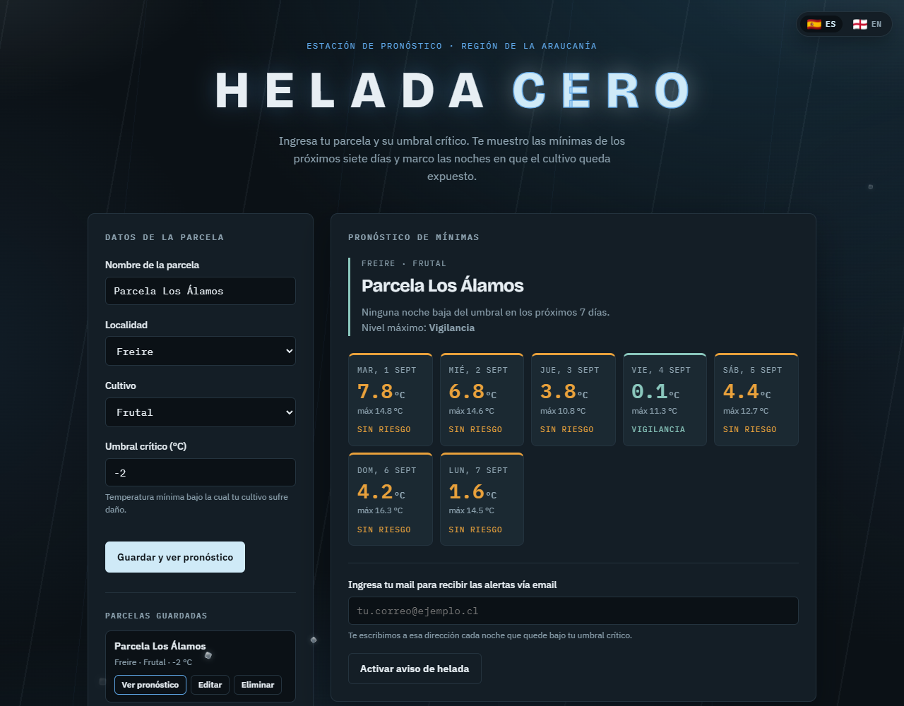
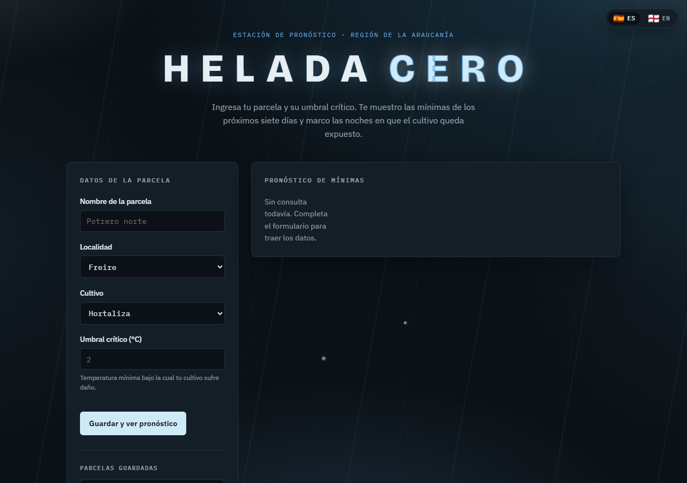
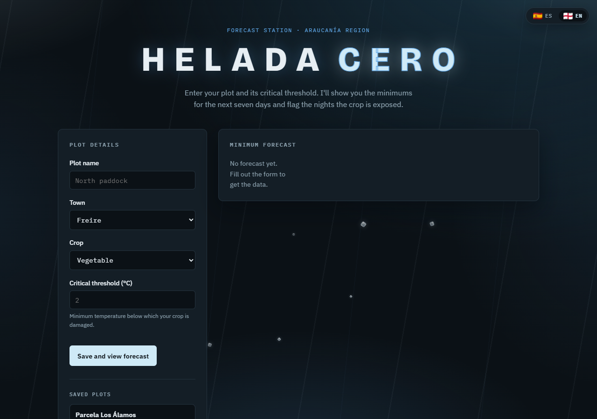
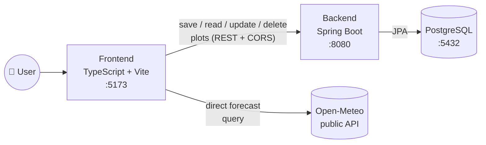

<p align="right">
  <a href="README.md"> Español</a>
  &nbsp;|&nbsp;
   <strong>English</strong>
</p>

# Helada Cero

<p>
  
  
  
  
  
  
</p>

*("Zero Frost")* — a full-stack app that fetches the 7-day minimum-temperature forecast for a farm plot in Chile's Araucanía Region and flags the nights that put the crop at risk of frost.

The user registers a plot (name, town, crop type, and a critical temperature threshold in °C); that plot is saved in a dedicated microservice with real persistence in PostgreSQL. Once the plot is saved, the interface classifies each day of the forecast into four risk levels — safe, watch, at-risk, frost — by comparing the projected minimum against that threshold, and lets the user leave an email address to receive alerts for the critical nights detected.

Weather data comes from the public [Open-Meteo](https://open-meteo.com/) API, which requires no key and publishes its data under a CC BY 4.0 license.



<table>
<tr>
<td width="50%"></td>
<td width="50%"></td>
</tr>
</table>

## Quick start (one command)

With [Docker](https://www.docker.com/) installed and running, this brings up PostgreSQL, the backend, and the frontend together:

```bash
docker compose up --build
```

- Frontend: http://localhost:5173
- Backend: http://localhost:8080 · Swagger-UI: http://localhost:8080/swagger-ui.html

For actual development (hot-reload for TypeScript and Java, instead of rebuilding the image on every change), use the flow in the [Frontend](#frontend) and [Backend](#backend) sections below — there, Docker Compose only brings up PostgreSQL.

## Architecture

Monorepo with two projects:

```
helada-cero/
├── src/          Frontend — Vanilla TypeScript + Vite
└── backend/      Backend  — Spring Boot + PostgreSQL + Docker
```

The forecast is still fetched straight from Open-Meteo in the browser (it's third-party, public, stateless data — routing it through a server of our own would add nothing). What does get persisted is the **plot** itself: on form submit, the frontend first saves (or updates) it in the backend — which writes it to PostgreSQL — and only then queries the forecast for the now-persisted plot. The "Saved plots" panel reads from that same backend and lets the user reopen, edit, or delete any record. It's the full data cycle: `TypeScript → fetch → Spring Boot → JPA → PostgreSQL`, with no CORS blocks.



---

## Frontend

### Stack

- **Vanilla TypeScript** in strict mode (`strict`, `noUncheckedIndexedAccess`, zero use of `any`)
- **Vite 5** as dev server and bundler
- **Native ES modules** — no frameworks, no UI libraries
- **Fetch API** with `async/await` and `try/catch` blocks

### Install and run

```bash
# Install dependencies
npm install

# Start the hot-reloading dev server
npm run dev

# Run the unit tests (Vitest)
npm run test

# Type-check and build for production
npm run build
```

The app is served at `http://localhost:5173`. For saving plots to work, the [backend](#backend) needs to be running alongside it (`http://localhost:8080` by default).

### Environment variables

| Variable            | Description            | Default                  |
|----------------------|-------------------------|----------------------------|
| `VITE_API_BASE_URL` | Base URL of the backend | `http://localhost:8080`  |

See [`.env.example`](.env.example). A real `.env` file stays out of git (`.gitignore`); there's no secret to protect here (it's just a URL), but it's documented as an environment variable anyway so the backend host is never hardcoded and can be pointed at another environment without touching a line of code.

### Project structure

```
src/
├── models/          Domain interfaces and enums
│   ├── parcela.ts     Parcela, TipoCultivo, Localidad, coordinates
│   ├── pronostico.ts  API contract + domain model, NivelRiesgo
│   └── estado.ts      EstadoSolicitud (INACTIVO | CARGANDO | EXITO | ERROR), TonoMensaje
├── services/        Communication with external services
│   ├── climaService.ts      Queries Open-Meteo, 5 s timeout, typed validation and mapping
│   ├── parcelaApiService.ts Saves/reads/updates/deletes plots against the backend
│   └── alertaService.ts     Simulated email-subscription submission
├── i18n/            Language switcher (Spanish/English)
│   ├── idioma.ts       Active language, localStorage persistence, change subscription
│   └── textos.ts       Single ES/EN dictionary read by every component and service
├── components/      Pure functions that render markup
│   ├── DiaCard.ts
│   ├── ResumenParcela.ts
│   ├── ParcelasGuardadas.ts List of saved plots, with view/edit/delete actions
│   └── Nevada.ts       Decorative background: falling ice crystals
├── utils/           Reusable business logic
│   ├── riesgo.ts       Risk classification and date formatting
│   └── texto.ts        HTML escaping for safe template interpolation
├── main.ts          DOM capture, events, and async orchestration
└── style.css

# *.test.ts files sit next to the code they test (risk, text, plot, i18n
# texts) — run with `npm run test` (Vitest, see vite.config.ts).
```

### Design decisions

- **State as enums, not loose flags.** `EstadoSolicitud` replaces the classic `cargando` / `hayError` pair. `TonoMensaje` does the same for feedback-message color: never controlled with a `boolean esError` or free-form strings.
- **A raw API response never flows through the app.** Both `climaService` and `parcelaApiService` validate the JSON's shape with a type guard before translating it into the domain model.
- **`catch (error: unknown)`.** TypeScript never guarantees that what's thrown is an `Error`, so the type is narrowed before reading `.message`.
- **Custom timeout on network calls.** `fetch` doesn't time out on its own: if the server accepts the connection and never responds, the UI stays stuck loading forever. Both `climaService` and `parcelaApiService` cut it off after 5 seconds with `AbortController`.
- **All dynamic text is escaped before it reaches the DOM.** Components build markup with string templates; the plot name and any other value that isn't a code constant goes through `escaparHtml` so the user can't inject and run HTML/JS.
- **A real language switcher, not just in the docs.** The 🇪🇸/🏴 buttons at the top-right of the app translate the whole interface on the fly (no reload), backed by a single dictionary in [`i18n/textos.ts`](src/i18n/textos.ts) that both the components and the three services read from. The chosen language persists in `localStorage`.
- **A plot's coordinate is never typed in by the user.** It's derived from the chosen town (`COORDENADAS`), the same source of truth the backend uses — so no value sent over HTTP can carry an invalid or inconsistent coordinate.
- **The color scale runs from warm to ice.** The dashboard visually cools down as risk climbs, and frost is the only state with a frost texture.
- **The background simulates cold: wind, frost, and snow falling across the whole screen.** Purely decorative (`aria-hidden`, `pointer-events: none`) and respects `prefers-reduced-motion`. By design, the ice drifts in front of the header, the form, and the footer, but never in front of `.resultados` — the forecast panel is the one result that must always stay legible.

---

## Backend

REST microservice that persists the farm plots being monitored against frost: Spring Boot, PostgreSQL, and Docker, with contracts documented via Swagger/OpenAPI.

### Stack

- **Java 21** + **Spring Boot 3.3.5**
- **Spring Web** — REST controllers
- **Spring Data JPA** + **PostgreSQL 16** (containerized with Docker Compose)
- **Bean Validation** (`jakarta.validation`) on inbound DTOs
- **springdoc-openapi** — generates the OpenAPI spec and the Swagger-UI console, active only under the `dev` profile
- **H2** (tests only) — lets `mvn test` run without Docker; lives in `scope: test` and never ships in the runnable JAR nor activates in `dev`/`prod`

### Architecture

```
backend/src/main/java/com/heladacero/
├── domain/                 Pure business model: zero JPA, zero Spring Web
│   ├── model/                 Parcela, Coordenada, TipoCultivo, Localidad (coordinate built in)
│   ├── exception/              ParcelaNoEncontradaException, ParcelaDuplicadaException
│   └── repository/             ParcelaRepository (outbound port)
├── application/service/     Use cases (ParcelaService): orchestrates business rules
└── infrastructure/          Everything that knows about HTTP, JSON, JPA, and SQL
    ├── persistence/            ParcelaEntity, ParcelaJpaRepository, ParcelaRepositoryAdapter
    ├── web/controller/         ParcelaController — /api/v1/parcelas routes
    ├── web/dto/                Request/Response, the JPA entity is never exposed
    ├── web/advice/             GlobalExceptionHandler (@RestControllerAdvice)
    └── config/                 OpenApiConfig (@Profile("dev")), CorsConfig
```

The domain imports nothing from `infrastructure`; `infrastructure.persistence` translates between `Parcela` (domain) and `ParcelaEntity` (JPA) via `ParcelaEntityMapper`, and `infrastructure.web` translates between `Parcela` and the HTTP DTOs via `ParcelaDtoMapper`.

A plot's coordinate is never written by the HTTP client: every value of the `Localidad` enum carries its own latitude/longitude (`Localidad#coordenada()`), just like the frontend's `COORDENADAS`. The user picks a town from a closed list; the server resolves the coordinate. Fewer fields to fill in by hand, and no coordinate can ever be invalid or inconsistent with the declared town.

### Running everything locally

For actual development (Java hot-reload on save, no Docker image rebuild needed):

1. **Database** (PostgreSQL in Docker), from `backend/` — this `docker-compose.yml` only has the `db` service; it's different from the one at the repo root (which brings up the whole stack, see [Quick start](#quick-start-one-command)):

   ```bash
   docker compose up -d
   ```

2. **Application** (`dev` profile active by default):

   ```bash
   ./mvnw spring-boot:run
   ```

   On Windows: `mvnw.cmd spring-boot:run`

3. The API comes up at `http://localhost:8080`.

There's also a multi-stage [`Dockerfile`](backend/Dockerfile) (Maven build, JRE-only runtime, non-root user) for when the backend needs to ship as an image — it's what the root `docker-compose.yml` uses.

### Documentation and contract testing

- **Swagger-UI**: http://localhost:8080/swagger-ui.html
- **OpenAPI JSON**: http://localhost:8080/api-docs

Both routes exist only under the `dev` profile. Under `prod` (`SPRING_PROFILES_ACTIVE=prod`) they're explicitly disabled and return 404 — see [`OpenApiConfig`](backend/src/main/java/com/heladacero/infrastructure/config/OpenApiConfig.java) and [`application-prod.yml`](backend/src/main/resources/application-prod.yml).

### CORS

[`CorsConfig`](backend/src/main/java/com/heladacero/infrastructure/config/CorsConfig.java) enables CORS for `/api/**` only, and only for the origins listed in `app.cors.allowed-origins` — never `*`. In `dev` it defaults to `http://localhost:5173` and `http://localhost:4173` (Vite dev/preview); in `prod` there's no default, it must come from the `CORS_ALLOWED_ORIGINS` environment variable.

### Endpoints

| Verb     | Route                    | Description                    | Success | Errors        |
|----------|--------------------------|----------------------------------|---------|---------------|
| `POST`   | `/api/v1/parcelas`       | Registers a plot                | 201     | 400, 422      |
| `GET`    | `/api/v1/parcelas`       | Lists all plots                 | 200     | —             |
| `GET`    | `/api/v1/parcelas/{id}`  | Gets a plot by id                | 200     | 404           |
| `PUT`    | `/api/v1/parcelas/{id}`  | Replaces an existing plot        | 200     | 400, 404, 422 |
| `DELETE` | `/api/v1/parcelas/{id}`  | Deletes a plot                   | 204     | 404           |

The `POST`/`PUT` body is `{ nombre, cultivo, localidad, umbralCritico }` — no latitude/longitude, those are resolved automatically from `localidad`. Every error comes back as a unified `ErrorResponse` (`timestamp`, `status`, `codigo`, `mensaje`, `ruta`); never a native server stack trace — see [`GlobalExceptionHandler`](backend/src/main/java/com/heladacero/infrastructure/web/advice/GlobalExceptionHandler.java).

### Environment variables (`prod` profile)

| Variable               | Description                                     |
|--------------------------|--------------------------------------------------|
| `DB_HOST`              | Production PostgreSQL host                       |
| `DB_PORT`              | Port (defaults to `5432`)                        |
| `DB_NAME`              | Database name                                    |
| `DB_USERNAME`          | Database user                                    |
| `DB_PASSWORD`          | Database password                                |
| `CORS_ALLOWED_ORIGINS` | Exact frontend origin(s), comma-separated        |

See [`backend/.env.example`](backend/.env.example). In `dev`, the database variables are optional (if undefined, the `docker-compose.yml` values are used: `heladacero_db` / `dev_user` / `SecureDevPassword123`); `CORS_ALLOWED_ORIGINS` does have a `dev` default (the Vite ports). None of these variables, nor their real production values, are ever written to a versioned file — both `.gitignore` files (root and `backend/`) explicitly exclude `.env`, `.env.local`, and `application-local.yml`.

### Tests

```bash
cd backend
./mvnw test
```

Runs against in-memory H2 (`test` profile) — no Docker required. Two suites cover the core business rules with JUnit 5 + Mockito:

- [`ParcelaServiceTest`](backend/src/test/java/com/heladacero/application/service/ParcelaServiceTest.java) — pure unit test: `ParcelaRepository` mocked, no Spring context. Covers the duplicate rule (name + town), the propagation of `ParcelaNoEncontradaException`, and id assignment on creation.
- [`ParcelaControllerTest`](backend/src/test/java/com/heladacero/infrastructure/web/controller/ParcelaControllerTest.java) — `@WebMvcTest` slice: verifies that every case (success, validation, duplicate, not found) comes back with the correct HTTP status and no native stack trace, with `ParcelaService` mocked.

---

## Continuous integration

Every `push`/`pull request` to `main` runs on [GitHub Actions](.github/workflows/ci.yml): the frontend's 22 tests (Vitest) + strict type-check + production build, and the backend's 17 tests (JUnit 5 + Mockito) + jar packaging. The badge above reflects the latest run's status.

## License

[MIT](LICENSE) — free to use, copy, and modify.

## Data credits

Weather data: [Open-Meteo.com](https://open-meteo.com/) — CC BY 4.0.
