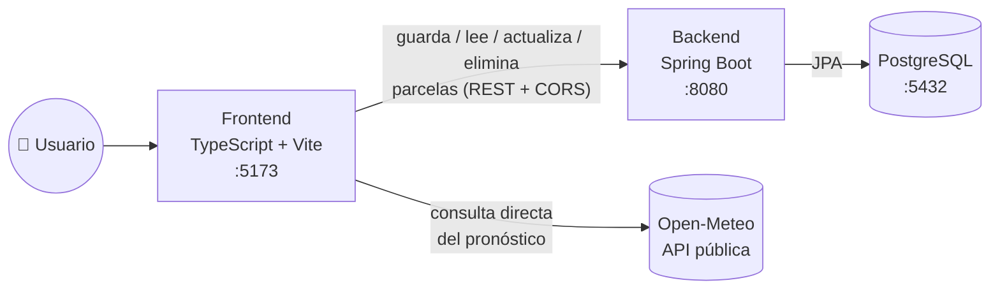

<p align="right">
   <strong>Español</strong>
  &nbsp;|&nbsp;
  <a href="README.en.md"> English</a>
</p>

# Helada Cero

<p>
  
  
  
  
  
  
</p>

Aplicación full-stack que consulta el pronóstico de temperaturas mínimas de los próximos 7 días para una parcela agrícola de la Región de La Araucanía y marca las noches en que el cultivo queda expuesto a helada.

El usuario registra una parcela (nombre, localidad, tipo de cultivo y umbral crítico en °C); esa parcela se guarda en un microservicio propio con persistencia real en PostgreSQL. Con la parcela ya guardada, la interfaz clasifica cada día del pronóstico en cuatro niveles de riesgo —sin riesgo, vigilancia, riesgo y helada— comparando la mínima proyectada contra ese umbral, y permite dejar un correo electrónico para recibir el aviso de las noches críticas detectadas.

Los datos meteorológicos provienen de la API pública de [Open-Meteo](https://open-meteo.com/), que no requiere clave y publica sus datos bajo licencia CC BY 4.0.


<table>
<tr>
<td width="50%"></td>
<td width="50%"></td>
</tr>
</table>

## Arranque rápido (un solo comando)

Con [Docker](https://www.docker.com/) instalado y corriendo, esto levanta PostgreSQL, el backend y el frontend juntos:

```bash
docker compose up --build
```

- Frontend: http://localhost:5173
- Backend: http://localhost:8080 · Swagger-UI: http://localhost:8080/swagger-ui.html

Para desarrollar de verdad (hot-reload de TypeScript y de Java, en vez de reconstruir la imagen en cada cambio), usa el flujo de las secciones [Frontend](#frontend) y [Backend](#backend) más abajo — Docker Compose ahí solo levanta PostgreSQL.

## Arquitectura

Monorepo con dos proyectos:

```
helada-cero/
├── src/          Frontend — TypeScript Vanilla + Vite
└── backend/      Backend  — Spring Boot + PostgreSQL + Docker
```

El pronóstico se consulta directo a Open-Meteo desde el navegador (es un dato de terceros, público y sin estado; no tiene sentido hacerlo pasar por un servidor propio). Lo que sí persiste es la **parcela** en sí: al enviar el formulario, el frontend primero la guarda (o actualiza) en el backend — que la escribe en PostgreSQL — y solo entonces consulta el pronóstico con la parcela ya persistida. El panel "Parcelas guardadas" lee ese mismo backend y permite reabrir, editar o eliminar cualquier registro. Es el ciclo completo del dato: `TypeScript → fetch → Spring Boot → JPA → PostgreSQL`, sin bloqueos de CORS.



---

## Frontend

### Tecnologías

- **TypeScript Vanilla** con modo estricto (`strict`, `noUncheckedIndexedAccess`, cero uso de `any`)
- **Vite 5** como servidor de desarrollo y empaquetador
- **Módulos ES nativos** — sin frameworks ni librerías de UI
- **Fetch API** con `async/await` y bloques `try/catch`

### Instalación y ejecución

```bash
# Instalar dependencias
npm install

# Levantar el servidor de desarrollo en caliente
npm run dev

# Correr las pruebas unitarias (Vitest)
npm run test

# Verificar tipos y generar el build de producción
npm run build
```

La aplicación queda disponible en `http://localhost:5173`. Para que el guardado de parcelas funcione, el [backend](#backend) tiene que estar corriendo en paralelo (`http://localhost:8080` por defecto).

### Variables de entorno

| Variable            | Descripción                 | Por defecto              |
|----------------------|------------------------------|---------------------------|
| `VITE_API_BASE_URL` | Base de la API del backend  | `http://localhost:8080`  |

Ver [`.env.example`](.env.example). Un `.env` real queda fuera de git (`.gitignore`); en este caso no hay ningún secreto que proteger (es solo una URL), pero se documenta igual como variable de entorno para no cablear el host del backend en el código y poder apuntar a otro ambiente sin tocar una línea.

### Estructura del proyecto

```
src/
├── models/          Interfaces y enumeraciones del dominio
│   ├── parcela.ts     Parcela, TipoCultivo, Localidad, coordenadas
│   ├── pronostico.ts  Contrato de la API + modelo de dominio, NivelRiesgo
│   └── estado.ts      EstadoSolicitud (INACTIVO | CARGANDO | EXITO | ERROR), TonoMensaje
├── services/        Comunicación con servicios externos
│   ├── climaService.ts      Consulta a Open-Meteo, timeout de 5 s, validación y mapeo tipado
│   ├── parcelaApiService.ts Guarda/lee/actualiza/elimina parcelas contra el backend propio
│   └── alertaService.ts     Envío simulado de la suscripción por correo
├── i18n/            Selector de idioma (español/inglés)
│   ├── idioma.ts       Idioma activo, persistencia en localStorage, suscripción a cambios
│   └── textos.ts       Diccionario único ES/EN que leen todos los componentes y servicios
├── components/      Funciones puras que generan marcado
│   ├── DiaCard.ts
│   ├── ResumenParcela.ts
│   ├── ParcelasGuardadas.ts Lista de parcelas persistidas, con acciones ver/editar/eliminar
│   └── Nevada.ts       Fondo decorativo: cristales de hielo cayendo por la pantalla
├── utils/           Lógica de negocio reutilizable
│   ├── riesgo.ts       Clasificación de riesgo y formato de fechas
│   └── texto.ts        Escapado de HTML para interpolación segura en plantillas
├── main.ts          Captura del DOM, eventos y orquestación asíncrona
└── style.css

# Archivos *.test.ts junto al código que prueban (riesgo, texto, parcela,
# textos i18n) — corren con `npm run test` (Vitest, ver vite.config.ts).
```

### Decisiones de diseño

- **Estados con enumeraciones, no con banderas sueltas.** `EstadoSolicitud` reemplaza el clásico par `cargando` / `hayError`. `TonoMensaje` hace lo mismo con el color de los mensajes de retroalimentación: nunca se controla con un `boolean esError` ni con cadenas libres.
- **La respuesta cruda de una API nunca circula por la aplicación.** Tanto `climaService` como `parcelaApiService` validan la forma del JSON con una guardia de tipo antes de traducirlo al modelo de dominio.
- **`catch (error: unknown)`.** TypeScript no garantiza que lo lanzado sea un `Error`, así que el tipo se estrecha antes de leer `.message`.
- **Timeout propio en las llamadas de red.** `fetch` no corta la espera por sí solo: si el servidor acepta la conexión y nunca responde, la interfaz queda cargando para siempre. Tanto `climaService` como `parcelaApiService` cortan a los 5 segundos con `AbortController`.
- **Todo texto dinámico se escapa antes de entrar al DOM.** Los componentes arman marcado con plantillas de cadena; el nombre de la parcela y cualquier otro dato que no sea una constante del código pasan por `escaparHtml` para no ejecutar HTML/JS inyectado por el usuario.
- **Selector de idioma real, no solo en la documentación.** Los botones 🇪🇸/🏴 arriba a la derecha de la app traducen toda la interfaz al vuelo (sin recargar), con un único diccionario en [`i18n/textos.ts`](src/i18n/textos.ts) que leen tanto los componentes como los tres servicios. El idioma elegido se persiste en `localStorage`.
- **La coordenada de una parcela nunca la escribe el usuario.** Se deriva de la localidad elegida (`COORDENADAS`), la misma fuente de verdad que usa el backend — así ningún dato enviado por HTTP puede traer una coordenada inválida o inconsistente.
- **La escala de color va de tibio a hielo.** El tablero se enfría visualmente a medida que sube el riesgo, y la helada es el único estado con textura de escarcha.
- **El fondo simula frío: viento, escarcha y nieve cayendo por toda la pantalla.** Es puramente decorativo (`aria-hidden`, `pointer-events: none`) y respeta `prefers-reduced-motion`. Por diseño, el hielo pasa por delante de la cabecera, el formulario y el pie, pero nunca por delante de `.resultados` —el panel con el pronóstico es el único resultado que debe quedar siempre legible.

---

## Backend

Microservicio REST que persiste las parcelas agrícolas monitoreadas contra heladas: Spring Boot, PostgreSQL y Docker, con contratos documentados en Swagger/OpenAPI.

### Pila tecnológica

- **Java 21** + **Spring Boot 3.3.5**
- **Spring Web** — controladores REST
- **Spring Data JPA** + **PostgreSQL 16** (contenedorizada con Docker Compose)
- **Bean Validation** (`jakarta.validation`) sobre los DTOs de entrada
- **springdoc-openapi** — genera la especificación OpenAPI y la consola Swagger-UI, activa solo en el perfil `dev`
- **H2** (solo en tests) — permite correr `mvn test` sin Docker; vive en `scope: test` y nunca viaja al JAR ejecutable ni se activa en `dev`/`prod`

### Arquitectura

```
backend/src/main/java/com/heladacero/
├── domain/                 Modelo de negocio puro: cero JPA, cero Spring Web
│   ├── model/                 Parcela, Coordenada, TipoCultivo, Localidad (con su coordenada incorporada)
│   ├── exception/              ParcelaNoEncontradaException, ParcelaDuplicadaException
│   └── repository/             ParcelaRepository (puerto de salida)
├── application/service/     Casos de uso (ParcelaService): orquesta reglas de negocio
└── infrastructure/          Todo lo que sabe de HTTP, JSON, JPA y SQL
    ├── persistence/            ParcelaEntity, ParcelaJpaRepository, ParcelaRepositoryAdapter
    ├── web/controller/         ParcelaController — rutas /api/v1/parcelas
    ├── web/dto/                Request/Response, nunca se expone la entidad JPA
    ├── web/advice/             GlobalExceptionHandler (@RestControllerAdvice)
    └── config/                 OpenApiConfig (@Profile("dev")), CorsConfig
```

El dominio no importa nada de `infrastructure`; `infrastructure.persistence` traduce entre `Parcela` (dominio) y `ParcelaEntity` (JPA) mediante `ParcelaEntityMapper`, y `infrastructure.web` traduce entre `Parcela` y los DTOs HTTP mediante `ParcelaDtoMapper`.

La coordenada de cada parcela no la escribe el cliente HTTP: cada valor del enum `Localidad` lleva su latitud/longitud incorporada (`Localidad#coordenada()`), igual que el `COORDENADAS` del frontend. El usuario elige una localidad de una lista cerrada; el servidor resuelve la coordenada. Menos campos que llenar a mano y ninguna coordenada inválida o inconsistente con la localidad declarada.

### Cómo levantar todo en desarrollo

Para desarrollar (hot-reload de Java al guardar, sin reconstruir una imagen Docker cada vez):

1. **Base de datos** (PostgreSQL en Docker), desde `backend/` — este `docker-compose.yml` solo tiene el servicio `db`, es distinto al de la raíz del repo (que levanta todo el stack, ver [Arranque rápido](#arranque-rápido-un-solo-comando)):

   ```bash
   docker compose up -d
   ```

2. **Aplicación** (perfil `dev` activo por defecto):

   ```bash
   ./mvnw spring-boot:run
   ```

   En Windows: `mvnw.cmd spring-boot:run`

3. La API queda arriba en `http://localhost:8080`.

También existe un [`Dockerfile`](backend/Dockerfile) multi-stage (build con Maven, runtime solo con el JRE, usuario no-root) para cuando el backend necesita empaquetarse como imagen — es el que usa el `docker-compose.yml` de la raíz.

### Documentación y pruebas de contratos

- **Swagger-UI**: http://localhost:8080/swagger-ui.html
- **OpenAPI JSON**: http://localhost:8080/api-docs

Ambas rutas solo existen bajo el perfil `dev`. En `prod` (`SPRING_PROFILES_ACTIVE=prod`) están apagadas explícitamente y devuelven 404 — ver [`OpenApiConfig`](backend/src/main/java/com/heladacero/infrastructure/config/OpenApiConfig.java) y [`application-prod.yml`](backend/src/main/resources/application-prod.yml).

### CORS

[`CorsConfig`](backend/src/main/java/com/heladacero/infrastructure/config/CorsConfig.java) habilita `/api/**` solo para los orígenes listados en `app.cors.allowed-origins` — nunca `*`. En `dev` incluye por defecto `http://localhost:5173` y `http://localhost:4173` (Vite dev/preview); en `prod` no hay valor por defecto, tiene que venir sí o sí de la variable de entorno `CORS_ALLOWED_ORIGINS`.

### Endpoints

| Verbo    | Ruta                     | Descripción                          | Éxito | Errores      |
|----------|--------------------------|---------------------------------------|-------|--------------|
| `POST`   | `/api/v1/parcelas`       | Registra una parcela                 | 201   | 400, 422     |
| `GET`    | `/api/v1/parcelas`       | Lista todas las parcelas             | 200   | —            |
| `GET`    | `/api/v1/parcelas/{id}`  | Obtiene una parcela por id           | 200   | 404          |
| `PUT`    | `/api/v1/parcelas/{id}`  | Reemplaza una parcela existente      | 200   | 400, 404, 422|
| `DELETE` | `/api/v1/parcelas/{id}`  | Elimina una parcela                  | 204   | 404          |

El cuerpo de `POST`/`PUT` es `{ nombre, cultivo, localidad, umbralCritico }` — sin latitud/longitud, resueltas automáticamente a partir de `localidad`. Todo error sale como un `ErrorResponse` unificado (`timestamp`, `status`, `codigo`, `mensaje`, `ruta`); nunca una traza nativa del servidor — ver [`GlobalExceptionHandler`](backend/src/main/java/com/heladacero/infrastructure/web/advice/GlobalExceptionHandler.java).

### Variables de entorno (perfil `prod`)

| Variable               | Descripción                                           |
|-------------------------|--------------------------------------------------------|
| `DB_HOST`              | Host de la PostgreSQL de producción                   |
| `DB_PORT`              | Puerto (por defecto `5432`)                            |
| `DB_NAME`              | Nombre de la base de datos                             |
| `DB_USERNAME`          | Usuario de la base de datos                            |
| `DB_PASSWORD`          | Contraseña de la base de datos                         |
| `CORS_ALLOWED_ORIGINS` | Dominio(s) exacto(s) del frontend, separados por coma  |

Ver [`backend/.env.example`](backend/.env.example). En `dev`, las variables de base de datos son opcionales (si no se definen, se usan los valores del `docker-compose.yml`: `heladacero_db` / `dev_user` / `SecureDevPassword123`); `CORS_ALLOWED_ORIGINS` sí tiene un valor por defecto en `dev` (los puertos de Vite). Ninguna de estas variables, ni sus valores reales de producción, se escribe jamás en un archivo versionado — ambos `.gitignore` (raíz y `backend/`) excluyen explícitamente `.env`, `.env.local` y `application-local.yml`.

### Tests

```bash
cd backend
./mvnw test
```

Corre contra H2 en memoria (perfil `test`) — no requiere Docker levantado. Dos suites cubren las reglas de negocio centrales con JUnit 5 + Mockito:

- [`ParcelaServiceTest`](backend/src/test/java/com/heladacero/application/service/ParcelaServiceTest.java) — unidad pura: `ParcelaRepository` mockeado, sin contexto de Spring. Cubre la regla de duplicados (nombre + localidad), la propagación de `ParcelaNoEncontradaException` y la asignación de id al crear.
- [`ParcelaControllerTest`](backend/src/test/java/com/heladacero/infrastructure/web/controller/ParcelaControllerTest.java) — slice `@WebMvcTest`: verifica que cada caso (éxito, validación, duplicado, no encontrado) sale con el código HTTP correcto y sin traza nativa, con `ParcelaService` mockeado.

---

## Integración continua

Cada `push`/`pull request` a `main` corre en [GitHub Actions](.github/workflows/ci.yml): las 22 pruebas del frontend (Vitest) + chequeo de tipos estricto + build de producción, y las 17 pruebas del backend (JUnit 5 + Mockito) + empaquetado del jar. El badge de arriba refleja el estado del último run.

## Licencia

[MIT](LICENSE) — libre para usar, copiar y modificar.

## Créditos de datos

Datos meteorológicos: [Open-Meteo.com](https://open-meteo.com/) — CC BY 4.0.
